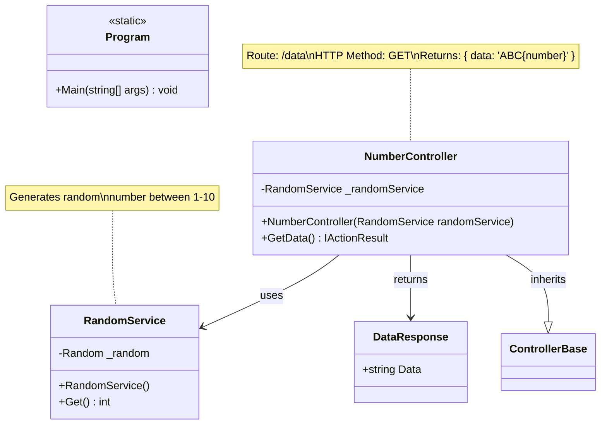

```mermaid
classDiagram
    class Program {
        <<static>>
        +Main(string[] args) void
    }

    class NumberController {
        -RandomService _randomService
        +NumberController(RandomService randomService)
        +GetData() IActionResult
    }

    class RandomService {
        -Random _random
        +RandomService()
        +Get() int
    }

    class DataResponse {
        +string Data
    }

    NumberController --> RandomService : uses
    NumberController --> DataResponse : returns
    NumberController --|> ControllerBase : inherits

    note for NumberController "Route: /data\nHTTP Method: GET\nReturns: { data: 'ABC{number}' }"
    note for RandomService "Generates random\nnumber between 1-10"

```
