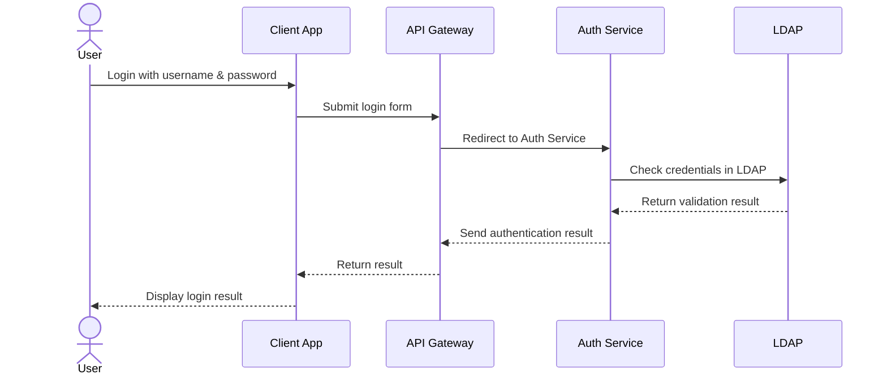

# Create REST API :: Get number

## Request 
GET /data

## Response 
code = 200
{
    "data": "ABC12"
}

## Project structure
ApiProject/
  + controllers/
    + NumberController.cs
  + services/
    + RandomService.cs

## RandomService.cs
* public int get()
* Random number 1-10 only

# Testing with WebApplicationFactory
* Microsoft.AspNetCore.Mvc.Testing

## Project structure
* ApiProject.Test/
  * NumberControllerIntegrationTests
    * Success case :: ทำการ stub RandomService ให้ return 5
    * GET /data

