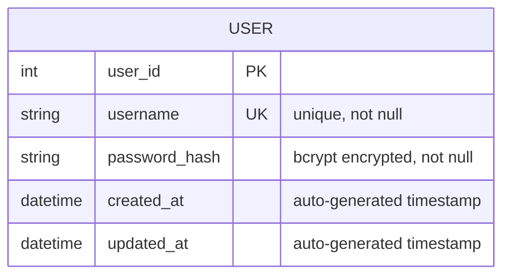

# Create REST API :: Register a new user

## Request 
POST /user

REquest Body with JSON
{
  "username": "somkiat",
  "password": "1234"
}

## Response 
code = 201
{
    "message": "Success"
}

code = 409 (username is existed)
{
    "message": "Invalid input"
}

## Project structure
ApiProject/
  + controllers/
    + UserController.cs
  + services/
    + UserService.cs
  + repositories/
    + UserRepository.cs

## Database design
* password ทำการเข้ารหัสด้วย bcrypt

ER diagram

# Testing with WebApplicationFactory
* Microsoft.AspNetCore.Mvc.Testing

## Project structure
* ApiProject.Test/
  * UserControllerIntegrationTests
    * Success case :: ทำการ stub UserRepository ให้ success
    * Failure case :: ทำการ stub UserRepository ให้ username is existed

